# 文章创作发表平台
## 系统介绍
- 文章创作发表平台，开发这个项目的缘由也很简单，在我接触了Github后，看到了很多人都写的一手漂亮的文档（README.md），便开始学习Markdown语法。然后也在CSDN使用Markdown写博客，CSDN博客也有Markdown编辑器，学习使用也方便，然而广告太多，使用就渐渐少了，就想试着自己整合一个可以使用Makrdown编辑器的网站，用户可以保存文档到数据库，后来就又增加完善了一点功能，索性当作毕业设计了。。。
## 设计与实现
- 技术路线
    - 后端：
        - Spring+SpringMVC+Mybatis+Druid连接池（基于Spring Boot搭建）
    - 前端
        - Layui+Editor.md(Markdown编辑器),项目非前后端分离项目，模板引擎为Thymeleaf。
    - 数据库：
        - MySQL
- 数据库设计
    - E-R图
    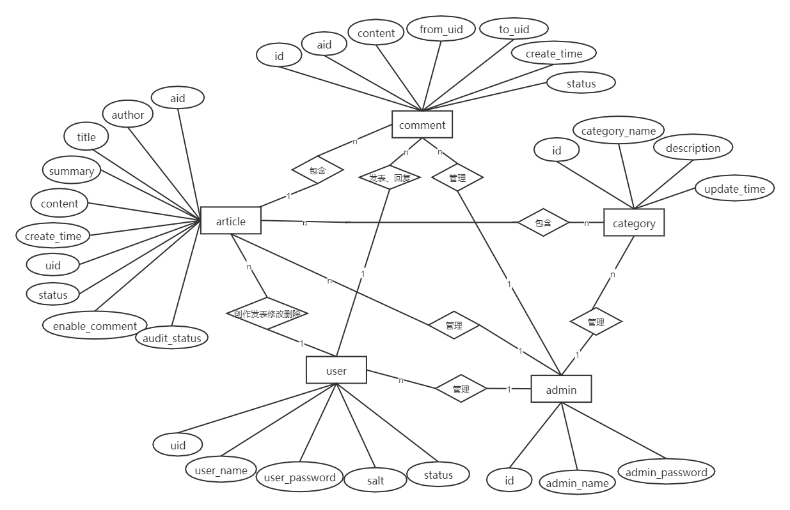
    
## 系统测试
### 用户端
- 用户登陆注册
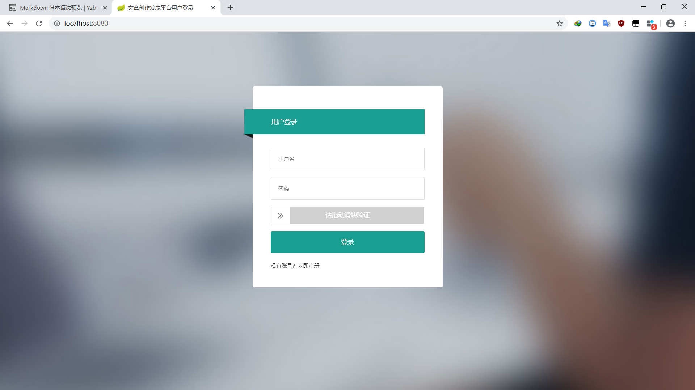
- 用户后台首页
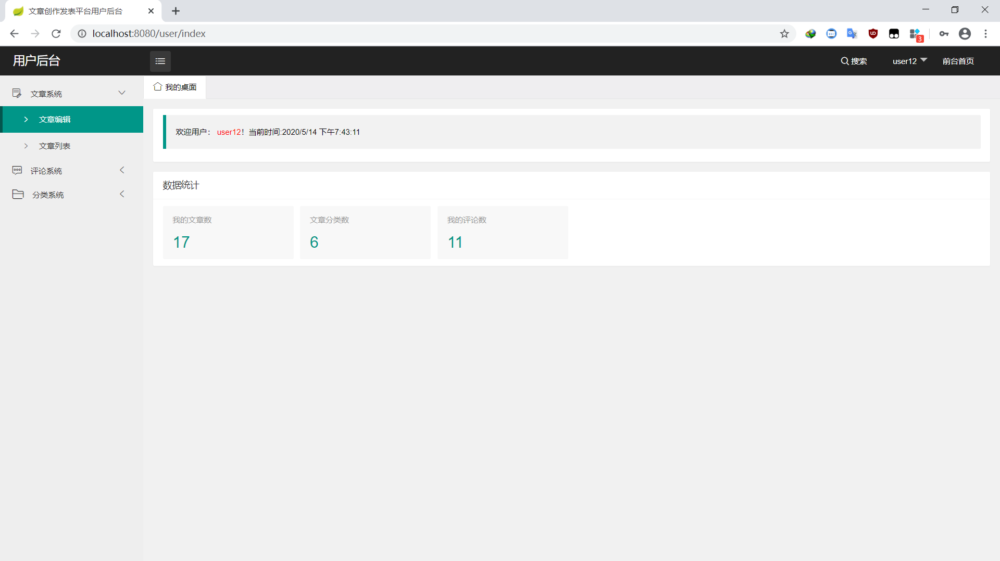
- 文章编辑发表
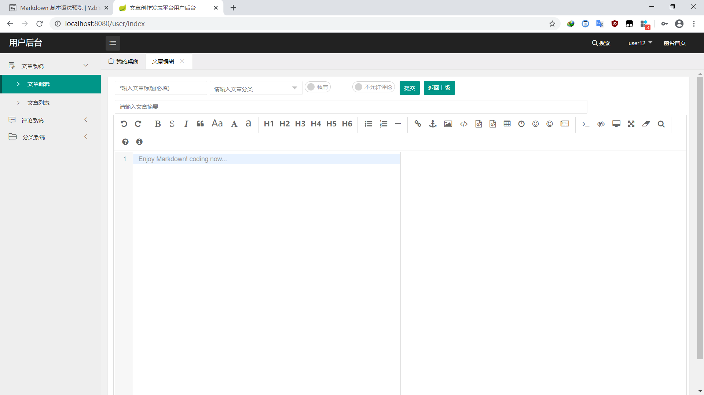
- 文章列表
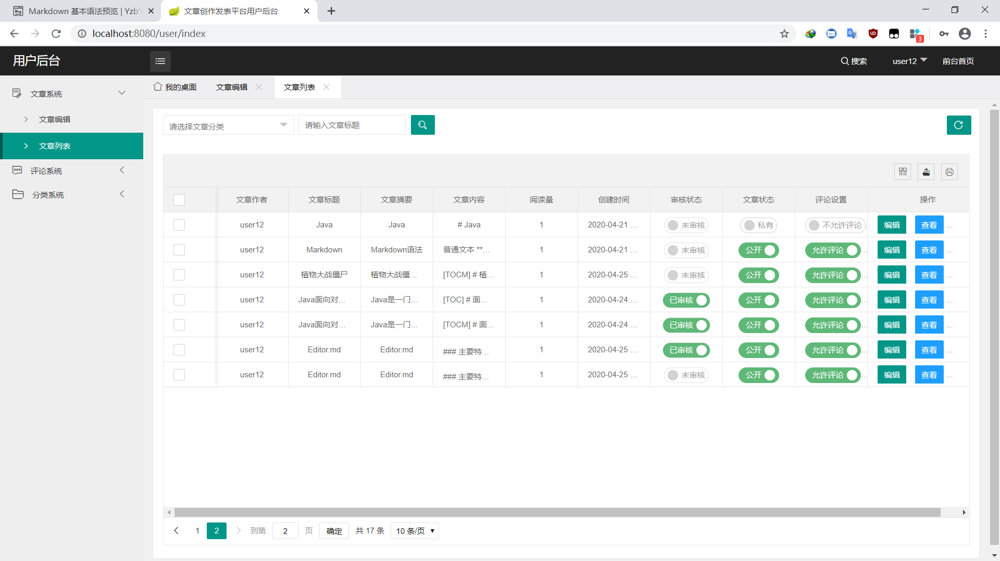
- 文章查看
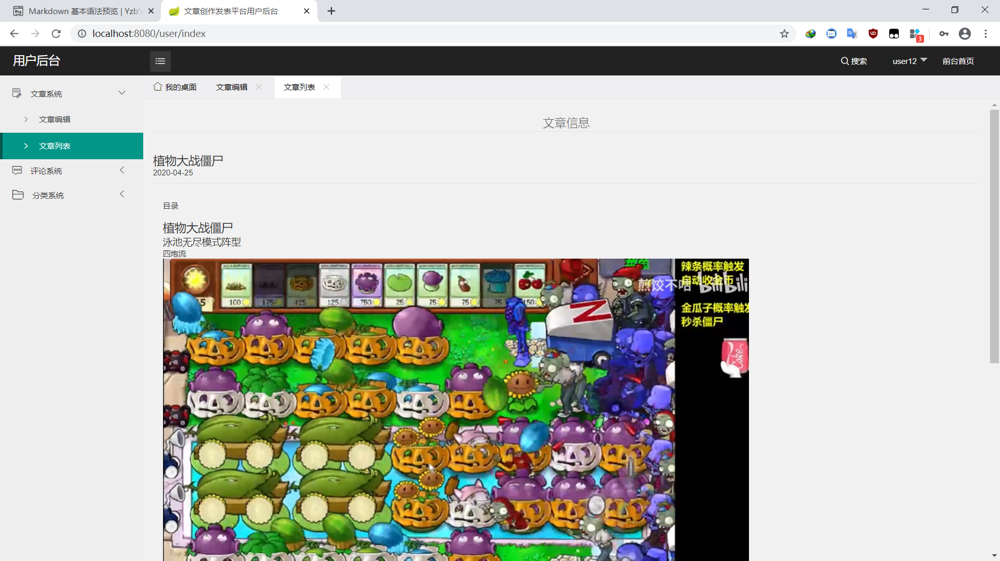
- 评论查看
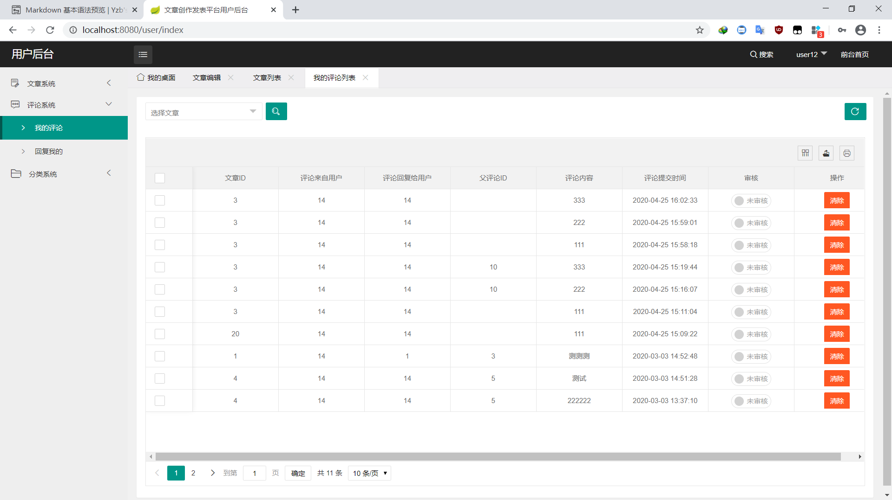
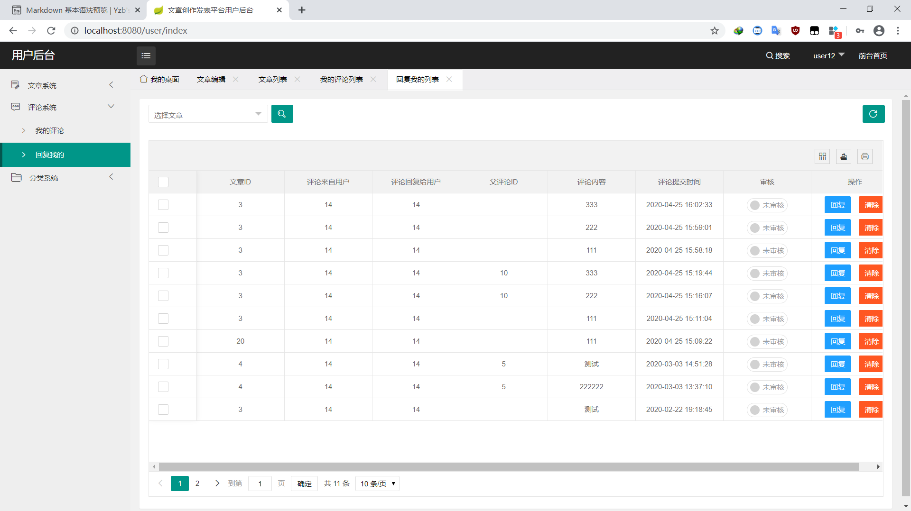
- 评论回复
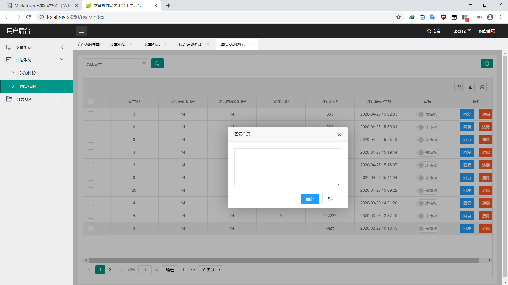
- 分类列表
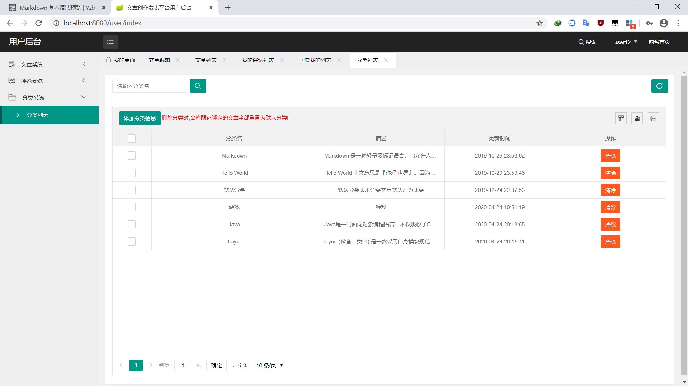

### 管理端
- 管理员登陆
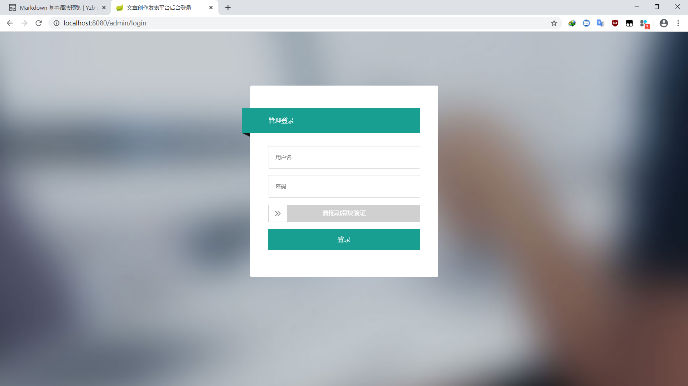
- 管理员首页
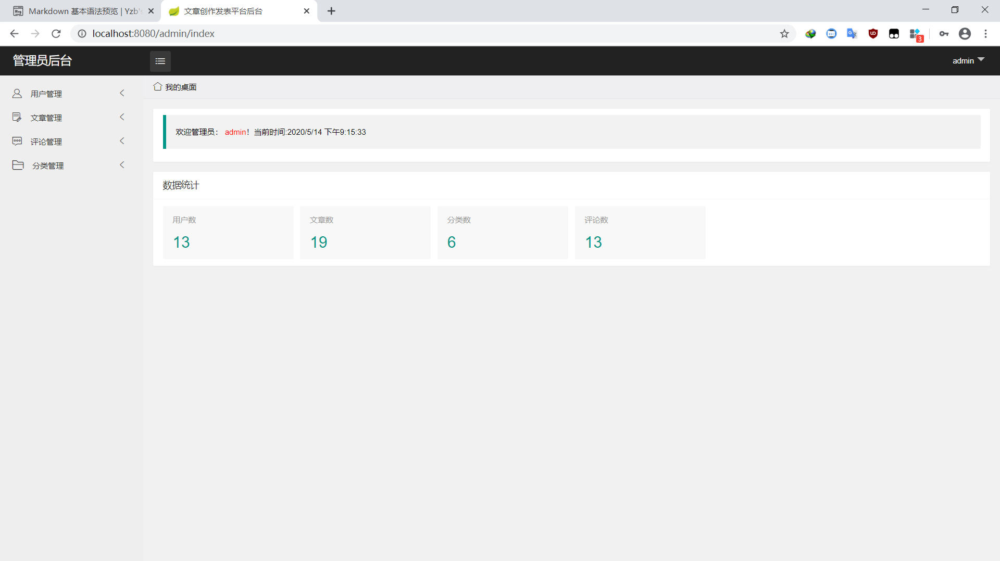
- 账号信息更改
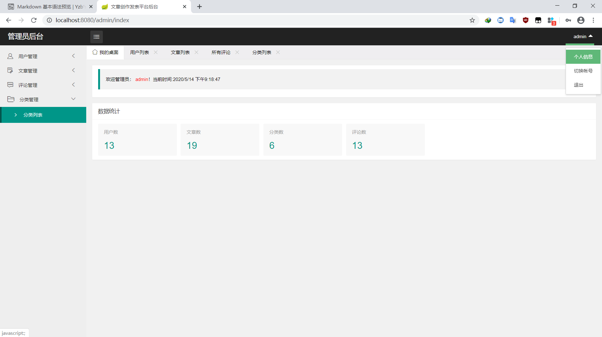
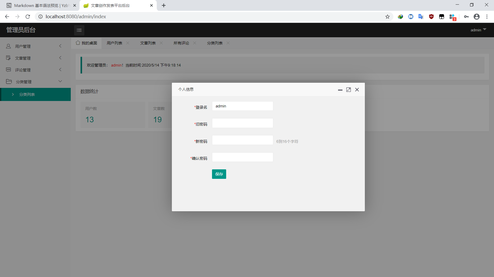
- 用户管理
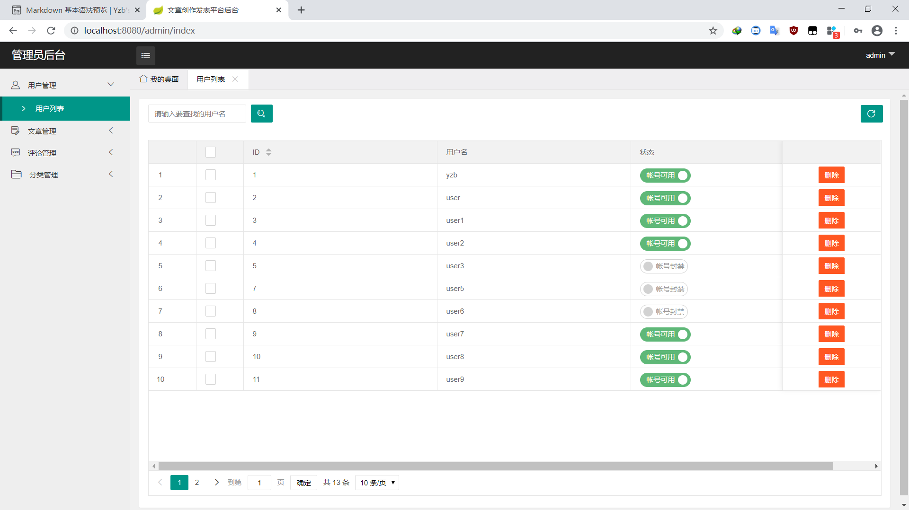
- 文章管理
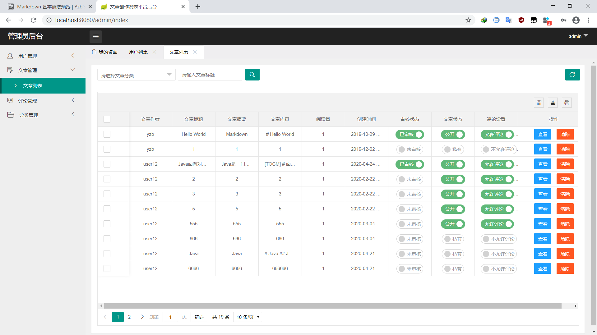
- 评论管理
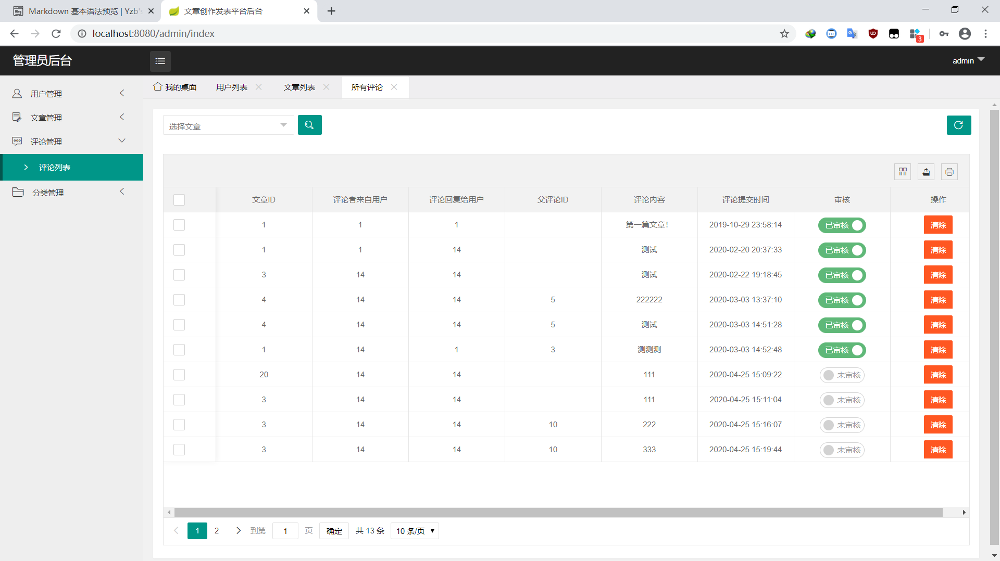
- 分类管理
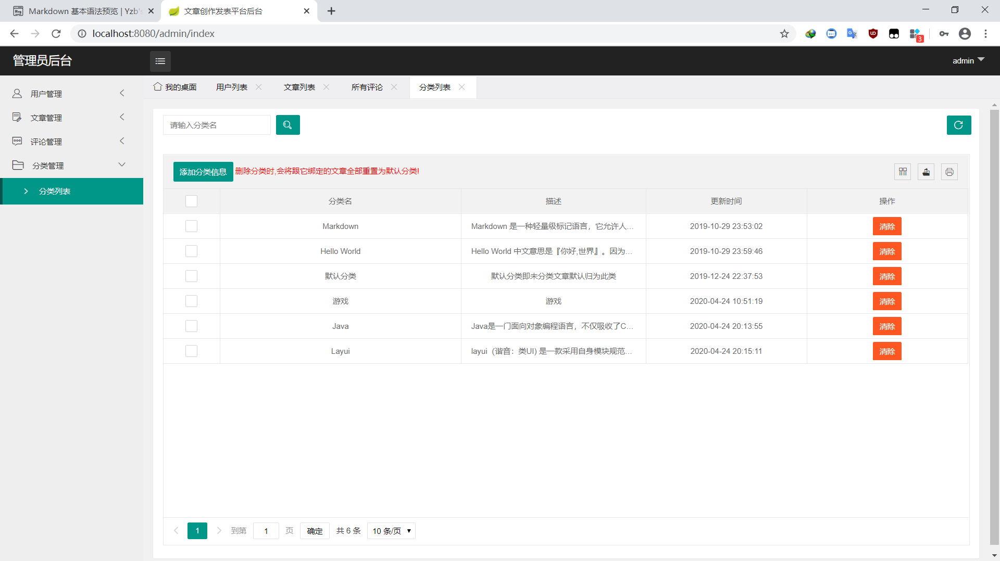
